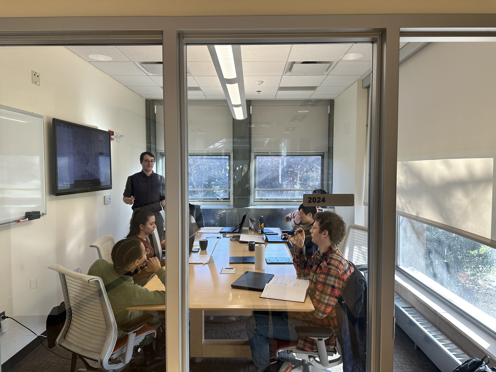
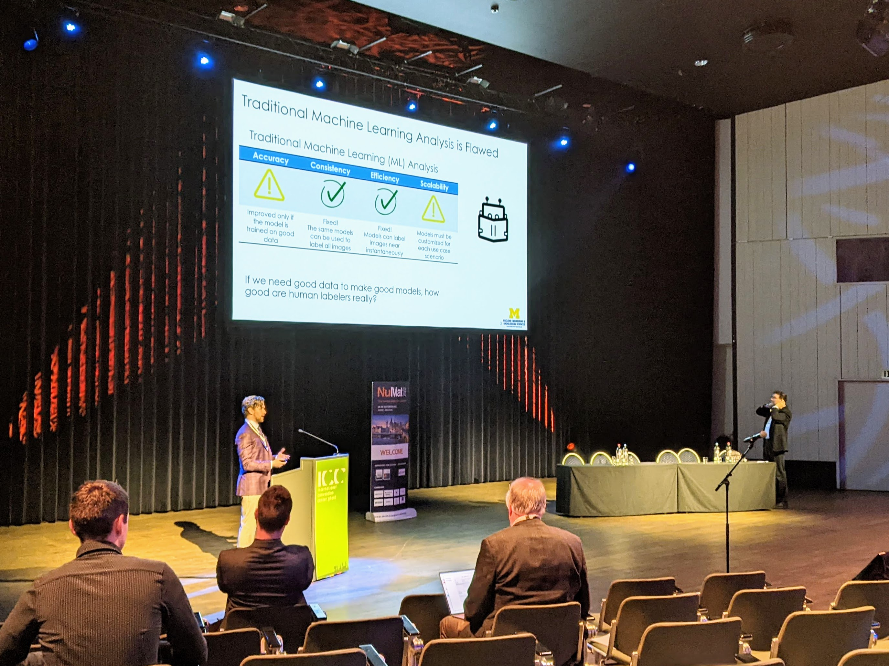

We are always interested in recruiting innovative undergraduates, graduate students, and postdoctoral fellows with diverse backgrounds to join the NOME lab. 

## Undergraduate Research Experience

Undergraduate students can pursue research experiences in the NOME lab through the University of Michigan <a href="https://lsa.umich.edu/urop/" target="_blank">Undergraduate Research Opportunity Programs</a>.

If you have any questions about the undergraduate research opportunities in our laboratory, you can
contact Prof. Field via <a href="../../#contact">email</a>.
 

## Joining as a Masters or PhD Student

If you are interested in pursuing your graduate studies in the NOME Lab, you can join us through the <a href="https://rackham.umich.edu/" target="_blank">Rackham Graduate School</a> through the <a href="https://ners.engin.umich.edu/academics/graduate/" target="_blank">Graduate Program</a> in the Nuclear Engineering and Radiological Sciences department. Applications are due in mid-December of every year.

The Nuclear Engineering and Radiological Sciences Graduate Program is consistently ranked as one of the top nuclear engineering programs by U.S. News and World Report. The program is diverse and broad with six faculty within the nuclear materials option.

<strong><u>Frequently Asked Questions from Prospective Graduate Students</strong></u> 
<strong>Q:</strong> <i>Are you taking on new graduate students in the Fall?</i> 
<strong>A:</strong> Yes! We are looking for 1 graduate student to start in the Fall 2023 term.

<strong>Q:</strong> <i>What departments do the group members come from?</i> 
<strong>A:</strong> The majority of our PhD students come with a background in Nuclear Engineering or Materials Science \& Engineering. However, due to the interdisciplinary nature of our research, we also have graduate and undergraduate students from Mechanical Engineering, Electrical Engineering, Physics, and Computer Science.

<strong>Q:</strong> <i>What projects have open positions?</i> 
<strong>A:</strong> Please visit our <a href="../../#projects/">projects page</a> for an idea regarding current and ongoing projects within the laboratory. Incoming graduate students could be incorporated into one of these listed projects or start a new project depending on the labs current and pending support. Incoming graduate students will have a general theme (e.g. advanced manufacturing) determined prior to your first semester but specific projects will not be determined until 1-2 months before the start of the first semester.

<strong>Q:</strong> <i>How does the group work?</i> 
<strong>A:</strong> Graduate students will meet individually with Prof. Field biweekly for mentoring and research discussions. No agenda is needed and they are meant to be generally informal and usually morph into a norm that works with the individual student. 

We also hold biweekly group meetings broken into two primary components: (i) housekeeping and (ii) technical discussions/presentations. The technical discussions are lead by students and provides an opportunity for students to practice scientific and technical communication. The group meetings typically run 1 to 1.5 hours. Special group meetings may be held prior to conferences/defenses/etc. to provide detailed feedback on external presentations. Other standard meetings include our biweekly "sub-group" meetings on Friday mornings where research project with similar interests or tasks meet to discuss technical progress, identify road-blocks, and establish deliverables and work direction for the following two weeks. Additional meetings can include break-out meetings based on project/topic. Finally, graduate students focused on radiation effects testing are required to attend the biweekly Michigan Ion Beam Laboratory (<a href="https://mibl.engin.umich.edu/" target="_blank">MIBL</a>) meeting led by Dr. Jiao. 

<strong>Q:</strong> <i>How does your group communicate?</i> 
<strong>A:</strong> Our group uses <a href="https://www.slack.com" target="_blank">Slack</a> for most quick questions, announcements, and other day-to-day operations in the group. E-mail is generally used for outside communication from the group. We also use Zoom for video calls or when students or Prof. Field are doing remote work. Meetings are scheduled and managed using Google Calendar and students have access to Prof. Field's calendar to know when they can touch base. 

<strong>Q:</strong> <i>Are your students required to GSI (TA) over the course of their programs?</i> 
<strong>A:</strong> Generally, no. Some masters students prefer to GSI to offset costs of the masters program, but PhD students are generally supported under sponsored program funds that don't require a GSI appointment. If students are interested in academics, it is strongly suggested to consider at least a semester of GSI to learn more about teaching within the higher education system. Prof. Field will have one GSI appointment for the 2023-2024, 2025-2026, and 2027-2028 academic years. 

<strong>Q:</strong> <i>Will I get to travel?</i> 
<strong>A:</strong> Modern science is a highly collaborative environment and nothing beats a face-to-face discussion to get across new ideas and make breakthroughs. We expect our graduate students to travel to better their work and develop connections for their career. Senior graduate students are encouraged to present their findings at 1 or more domestic conferences per year. If the student's work supports an on-going Department of Energy program it is possible to also attend coordination meetings and other workshops throughout the course of their graduate work.

<strong>Q:</strong> <i>What are the norms for vacation and time away from the lab?</i> 
<strong>A:</strong> Students are strongly encouraged to foster interests outside the lab and develop life long habit of maintaining a healthy work-life balance. This includes taking vacations and breaks throughout the year. Most students take extended vacation over holiday break and some weeks over the summer. As long as students are meeting milestones (discussed during one-on-ones!) they can take as little or as much time as they want. Day to day research is also highly cyclic, for instance some experiments may run 12-16 hrs a day over a week. You are encouraged and expected to take time after these hard weeks to recharge and stay healthy!!! 

<strong>Q:</strong> <i>How long will it take to get my PhD?</i> 
<strong>A:</strong> The PhD process is a highly individual process and the length of the process will depend on you and the project. The expectation is the first 2 years is spent taking the required coursework and developing the necessary skill sets to be an effective researcher. The last 2-3.5 years is then devoted towards completing your respective thesis. We expect students to take between 4 to 5.5 years to complete their PhD.

<strong>Q:</strong> <i>Can I contact current graduate students to get an idea about the group?</i> 
<strong>A:</strong> Yes! This is highly encouraged. The two foundations to your PhD is your project and adviser. Current graduate students in NOME can provide insight into the latter. Please see our <a href="../../#people">people page</a> for contact information for current graduate students and alumni.

If you have any questions about the graduate program, current projects, or seek references for Prof. Field as a supervisor please contact Prof. Field via <a href="../../#contact">email</a>.

## Joining as a Postdoctoral Fellow

If you are interested in applying to a postdoctoral position in the <a href="../../#about">NOME lab</a>, please read some
of our <a href="../../#publications">recent papers</a>. Then, write a two- to three-page thoughtful proposal outlining what you
want to work on in the NOME lab, how you can contribute, and what you want to get out of the experience. Please send your proposal with a cover letter explaining your suitability for the position, your full CV, and names of three references to Prof. Field via <a href="../../#contact">email</a>.

